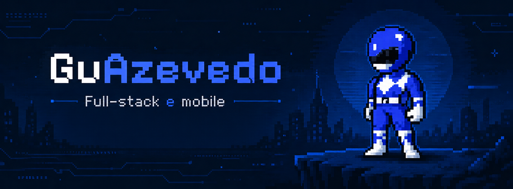

  

 

  <h2>Sobre Mim</h2>

<table>
<tr>
  
<td width="25%" align="center" valign="top">
  
</td>

<td width="75%" valign="top">

<h3>Olá — Eu sou o Gustavo</h3>

Tenho **17 anos**, estudo no **Cotemig** e desde que conheci a programação não parei mais.

Me interessa o que está na interseção entre **código e design** — interfaces que funcionam bem e parecem certas.

Atualmente estudo pela **Origamid** e construo projetos para transformar conhecimento em experiência real, tanto para **web** quanto para **mobile**.

<a href="SEU_PORTFOLIO">🌐 PORTFÓLIO</a>
&nbsp;&nbsp;&nbsp;
<a href="SEU_LINKEDIN">💼 LINKEDIN</a>
&nbsp;&nbsp;&nbsp;
<a href="mailto:SEU_EMAIL">📧 GMAIL</a>

</td>

</tr>
</table>

 

  <h2>Tecnologias</h2>

  

